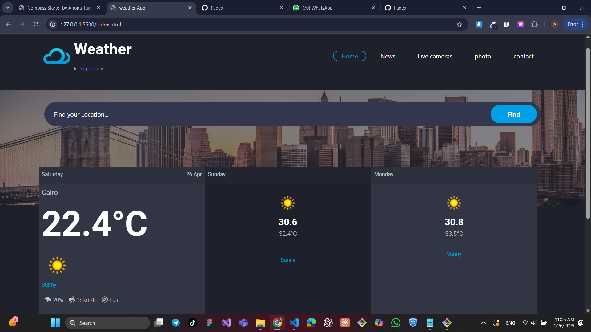

# 🌦️ Weather App

A simple weather forecast web app that allows users to search for any city and view the 3-day weather forecast using the [WeatherAPI](https://www.weatherapi.com/).

## 📸 Demo

 <!-- You can replace this with your actual screenshot file -->

## 🚀 Features

- Get current weather and a 3-day forecast for any city.
- Live search functionality as you type.
- Displays:
  - City name
  - Temperature
  - Weather condition icon and description
  - Wind speed, direction, and chance of rain
- Clean responsive UI with Bootstrap.

## 🔧 Technologies Used

- HTML5 / CSS3 / Bootstrap 5
- JavaScript (vanilla)
- [WeatherAPI](https://www.weatherapi.com/) for weather data

  

## 📦 How to Use

1. Clone the repository:
   ```bash
   git clone https://github.com/AhmedSayed26/weather-app.git

🚀 Getting Started With demo :
https://ahmedsayed26.github.io/weather-app/
